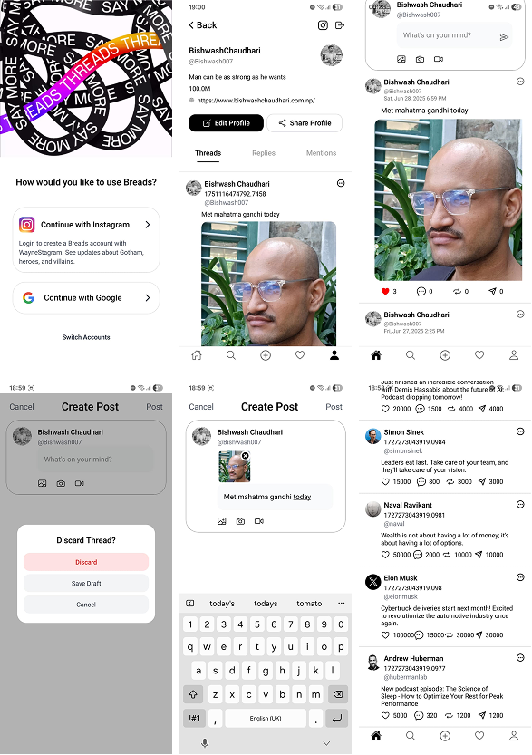

# 🥖 Breads Clone

This is a clone of the Threads app — think minimalist social vibes with power features.

## 🚀 Tech Stack

<div align="center" style="display: flex; justify-content: center; align-items: center; gap: 1.5rem; margin: 40px 0;">
  
  
  
  
</div>

## 📱 Screenshots

<div align="center">
  
</div>

## 🛠 Usage

1. Clone the repository

   ```zsh
   git clone https://github.com/Bishwash-007/breads.git
   cd breads
   ```

2. Install dependencies

   ```zsh
   npm install
   ```

3. Start the Convex server

   ```zsh
   npx convex dev
   ```

4. Start the app

   ```zsh
   npx expo start
   # or
   npm start
   ```

In the output, you'll find options to open the app in a

- [development build](https://docs.expo.dev/develop/development-builds/introduction/)
- [Android emulator](https://docs.expo.dev/workflow/android-studio-emulator/)
- [iOS simulator](https://docs.expo.dev/workflow/ios-simulator/)
- [Expo Go](https://expo.dev/go), a limited sandbox for trying out app development with Expo
